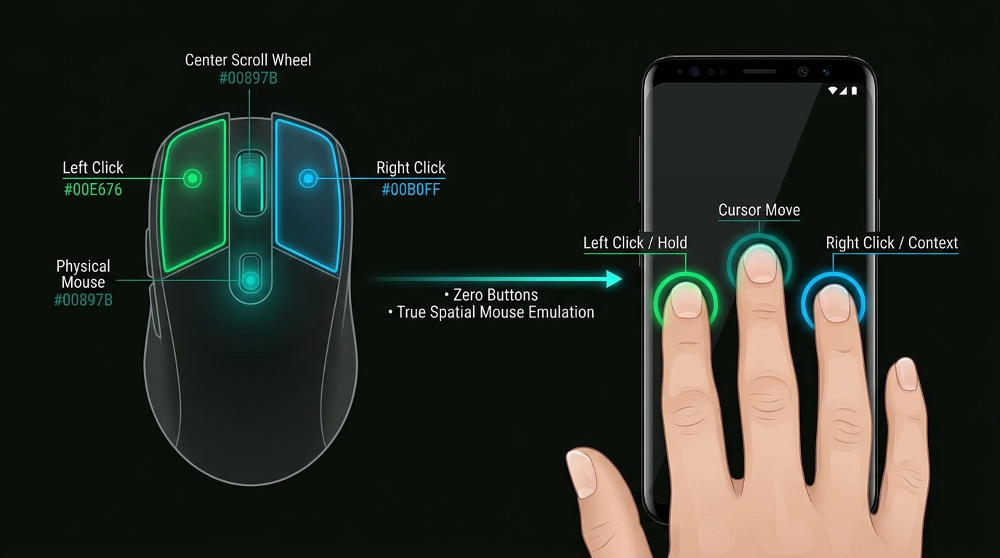
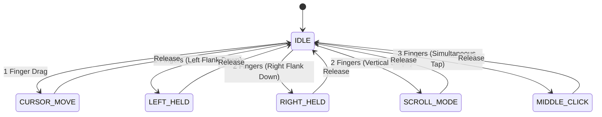
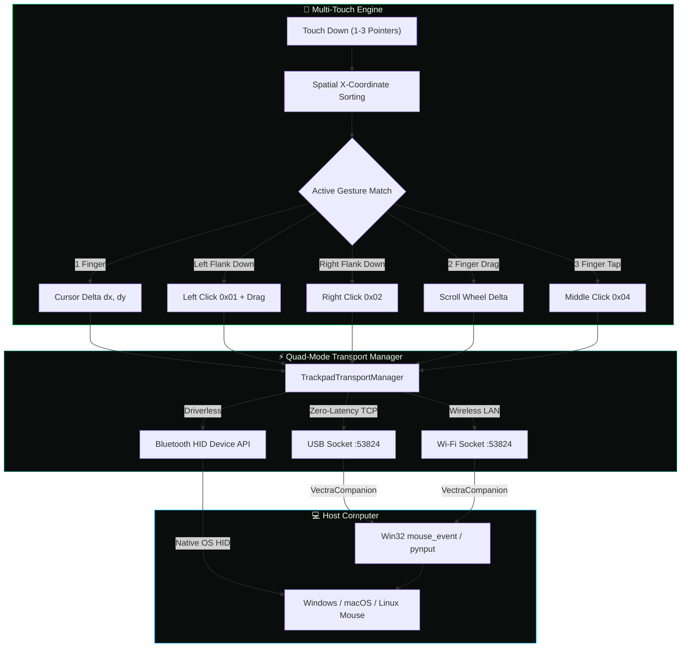

<!-- 
  VectraTouch — README
  SEO Keywords: 3-finger mouse emulation, spatial gesture trackpad, android trackpad app,
  phone as pc mouse, bluetooth hid mouse, wireless mouse for pc, driverless trackpad,
  virtual mouse controller, zero latency usb mouse, multi-touch trackpad, edge-to-edge touchpad
-->

<div align="center">


# VectraTouch

### The 3-Finger Spatial Mouse for Android

**Simulate a True Physical Mouse on Flat Glass · Zero On-Screen Buttons · Blind-Touch Precision**

[](https://github.com/subhranilBCG/VectraTouch/releases/latest)
[](https://developer.android.com)
[](https://kotlinlang.org)
[](LICENSE)

---

[🖐️ The 3-Finger Innovation](#-the-breakthrough-3-finger-spatial-mouse) · [📥 Download APK](#-download--install) · [🎮 Gesture Guide](#-gesture-mastery--controls) · [🏗️ Architecture](#%EF%B8%8F-how-it-works) · [🚀 Quick Start](#-quick-start)

</div>

---

## 💡 The Problem with Traditional Trackpad Apps

Every mobile trackpad app before VectraTouch shared the same fundamental flaw: **cramped on-screen buttons**.

```
❌ Traditional Virtual Trackpads:
┌────────────────────────────────────────────────────────┐
│  [  Tiny Left Button  ]        [  Tiny Right Button  ] │  ← You must LOOK DOWN
├────────────────────────────────────────────────────────┤  ← Miss clicks if thumb drifts
│                                                        │  ← Wastes 40% of the screen
│                   Cramped Touch Area                   │
│                                                        │
└────────────────────────────────────────────────────────┘
```

When using a real physical mouse, **your eyes never leave your monitor**. You instinctively know where your index, middle, and ring fingers are resting. On flat glass, however, static buttons force you to look away from your screen to make sure your fingers are aligned.

---

## 🖐️ The Breakthrough: 3-Finger Spatial Mouse



**VectraTouch replaces fixed UI buttons with dynamic Spatial X-Coordinate Sorting.**

Instead of forcing your fingers into specific boxes on the screen, VectraTouch turns your **entire phone display into an edge-to-edge tracking surface**. The moment your fingers touch the glass, our spatial engine dynamically sorts their horizontal positions:


| Finger Position | Dynamic Role | Mouse Action |
|:---:|:---:|:---|
| 👈 **Leftmost Finger (Index)** | **Left Click & Hold** | Primary click, double-click, and text/window dragging |
| 👆 **Center Finger (Anchor)** | **Cursor Driver** | Sub-pixel tracking (`dx`, `dy`) across your PC desktop |
| 👉 **Rightmost Finger (Ring)** | **Right Click & Context** | Context menus, right-click actions, and alternate options |

> 🌟 **Zero-Look Ergonomics:** Rest your hand anywhere on the screen naturally. Left is always left click, right is always right click, and the center steers — exactly like resting your hand on a physical desktop mouse.

---

## 🎮 Gesture Mastery & Controls

VectraTouch brings fluid desktop workflows to touchscreen glass with a dedicated 6-state multi-touch engine:



### 🎯 Gesture Cheat Sheet

| Gesture | How to Perform | Desktop Action |
|---|---|---|
| 🖱️ **Cursor Move** | Drag **1 finger** across the display | Move PC mouse pointer smoothly |
| 🔘 **Left Click** | Tap **1 finger** OR tap the **left flank** with 2 fingers | Standard primary click |
| 🔘 **Right Click** | Tap the **right flank** with 2 fingers | Open context / right-click menu |
| 📦 **Click & Drag** | **Hold left finger down** while **moving center finger** | Select text, drag windows, lasso select in CAD/games |
| 📜 **Precision Scroll** | Swipe up/down with **2 fingers simultaneously** | Smooth vertical page / document scrolling |
| 🌐 **Middle Click** | Tap **3 fingers simultaneously** anywhere | Open link in new browser tab / close tab |

---

## 🔀 Tri-Mode Transport: Zero-Lag Connectivity

Underneath the spatial gesture engine, VectraTouch provides three physical transport layers managed by an intelligent coordinator:


| Transport | Protocol | Setup Required | Best For |
|---|---|:---:|---|
| **🔵 Bluetooth HID** | Standard 4-Byte USB HID Descriptor | **Zero (Driverless)** | Office work, presentations, travel — pairs as a native OS mouse |
| **🔌 USB (ADB)** | Direct TCP on `127.0.0.1:53824` | 1-Click Script | Zero-latency gaming, audio/video editing, RF-crowded spaces |
| **📶 Wi-Fi (LAN)** | TCP + UDP Beacon (`53826`) | 1-Click Script | Wireless control across your room without Bluetooth pairing |
| **⚡ AUTO Mode** | Dynamic Priority Switcher | Auto | Intelligently falls back from USB → Wi-Fi → Bluetooth HID |

---

## 📥 Download & Install

### Direct APK Download

<div align="center">

[](https://github.com/subhranilBCG/VectraTouch/releases/latest/download/VectraTouch-v1.1.0.apk)

</div>

> **Requirements:** Android 9.0+ (API 28) · Bluetooth or USB Debugging enabled

### Installation Steps

1. **Download** `VectraTouch-v1.1.0.apk` from the button above (or [GitHub Releases](https://github.com/subhranilBCG/VectraTouch/releases/latest)).
2. **Install** the APK on your Android phone.
3. **Launch** VectraTouch and grant Bluetooth / Network permissions.

---

## 🚀 Quick Start

### 1. Bluetooth HID Mode (Driverless — No PC Software)
1. Open **VectraTouch** and select the **`BT`** tab (or `AUTO`).
2. On your PC/Mac, open **Bluetooth Settings → Add Device**.
3. Select your phone — it pairs instantly as a standard **Bluetooth Mouse**.
4. Start moving your fingers — zero software needed on your computer!

---

### 2. USB Mode (Zero Latency over USB Cable)
1. Connect your phone to your PC with a USB cable and enable **USB Debugging**.
2. Run the companion script on your PC:
   - **Windows:** Double-click [`host/run_usb_windows.bat`](host/run_usb_windows.bat) or [`VectraCompanion.cmd`](app/src/main/assets/VectraCompanion.cmd)
   - **Python (Mac/Linux):** `python host/vectra_usb_host.py`
3. Select the **`USB`** tab on your phone — enjoy sub-millisecond cursor response!

---

### 3. Wi-Fi Mode (Wireless LAN with Auto-Discovery)
1. Connect your phone and PC to the **same Wi-Fi network**.
2. Open VectraTouch and tap the **`WIFI`** tab.
3. Run [`host/run_wifi_windows.bat`](host/run_wifi_windows.bat) or `python host/vectra_usb_host.py --wifi`.
4. The companion automatically discovers your phone via UDP beacon — cursor control starts instantly!

---

### 📦 Offline In-App Companion Web Server

If you ever need the PC companion script without internet access:
1. Connect to the same Wi-Fi or USB tethering.
2. Open `http://<PHONE_IP>:8080` in your PC browser (hosted directly inside the app).
3. Download the standalone Windows (`.cmd`) or Python (`.py`) companion client right from your phone.

---

## ⚙️ In-Canvas Glassmorphic Settings

Tap the **⚙ (gear icon)** at the top of the trackpad to customize:
* **⌨ Keyboard Mode:** Open your phone's native soft keyboard to type directly onto your PC over Bluetooth HID, USB, or Wi-Fi with instant key injection.
* **Cursor Sensitivity Stepper:** Fine-tune speed (`0.4×` to `3.6×`) or tap presets (`0.8×`, `1.4×`, `2.0×`, `2.8×`).
* **Display Orientation Lock:** Landscape, Reverse Landscape, Portrait, or Auto-Sensor.
* **Haptic Feedback:** Tactile vibration pulses on clicks and gesture triggers.
* **Persistent Storage:** Preferences saved automatically via Android `SharedPreferences`.

---

## 🏗️ How It Works



---

## 📁 Project Structure

```
VectraTouch/
├── app/
│   ├── src/main/
│   │   ├── java/com/example/vectratrackpad/
│   │   │   ├── MainActivity.kt              # Immersive fullscreen & permissions
│   │   │   ├── TrackpadView.kt              # 3-Finger spatial engine & Canvas HUD
│   │   │   ├── TrackpadTransportManager.kt  # Transport coordinator (AUTO/BT/USB/WIFI)
│   │   │   ├── BluetoothHidManager.kt       # Android Bluetooth HID device profile
│   │   │   ├── UsbTrackpadServer.kt         # Non-blocking TCP server + UDP beacon
│   │   │   └── CompanionHttpServer.kt       # Offline companion web server (port 8080)
│   │   ├── assets/
│   │   │   ├── index.html                   # Offline browser landing page
│   │   │   ├── VectraCompanion.cmd          # 1-Click zero-dependency Windows client
│   │   │   ├── VectraCompanion.ps1          # PowerShell mouse_event companion
│   │   │   └── VectraCompanion.py           # Python cross-platform client
│   │   └── res/                             # Cyber green themes, vectors & drawables
│   └── build.gradle.kts                     # Gradle configuration (v1.1.0)
├── host/
│   ├── vectra_usb_host.py                   # Python companion with single-instance lock
│   ├── run_usb_windows.bat                  # 1-Click USB launcher
│   └── run_wifi_windows.bat                 # 1-Click Wi-Fi launcher
├── docs/images/                             # High-resolution architectural diagrams
└── README.md                                # Project documentation
```

---

## 🔧 Building from Source

```bash
# 1. Clone repository
git clone https://github.com/subhranilBCG/VectraTouch.git
cd VectraTouch

# 2. Build signed release APK with Gradle
./gradlew assembleRelease

# Output: app/build/outputs/apk/release/app-release.apk
```

---

## ❓ Frequently Asked Questions

<details>
<summary><strong>Why is 3-finger spatial sorting better than on-screen buttons?</strong></summary>

Physical buttons work on a hardware mouse because tactile edges guide your fingers. On flat smartphone glass, you can't feel where buttons start or end, forcing you to look down at your hands. 

VectraTouch dynamically assigns finger roles based on their **relative horizontal positions**, meaning your hand can rest anywhere on the screen naturally without you ever taking your eyes off your computer monitor.
</details>

<details>
<summary><strong>Can I drag windows and select text with this gesture system?</strong></summary>

**Yes!** Simply place your index (left) finger down to engage Left Click / Hold, and move your middle (anchor) finger to drag files, select code/text, or drag application windows across your desktop.
</details>

<details>
<summary><strong>Does Bluetooth HID mode require installing any software on my PC?</strong></summary>

**No.** In Bluetooth HID mode, your Android device registers directly as a hardware Bluetooth mouse with Windows, macOS, Linux, ChromeOS, and iPadOS. It requires zero drivers and zero third-party software on your computer.
</details>

<details>
<summary><strong>When should I use USB or Wi-Fi mode instead of Bluetooth?</strong></summary>

- **USB mode:** Ideal for precision gaming, CAD, audio/video editing, or environments with heavy Bluetooth/2.4GHz interference where sub-millisecond response is critical.
- **Wi-Fi mode:** Ideal when you want wireless control from across the room without needing to pair Bluetooth devices.
</details>

---

## 🤝 Contributing

Contributions, issues, and feature suggestions are always welcome!  
Feel free to open an issue on the [Issues Page](https://github.com/subhranilBCG/VectraTouch/issues).

---

## 📄 License

This project is licensed under the **MIT License** — see the [LICENSE](LICENSE) file for details.

---

<div align="center">

**Made with 🖤 and ☝️ by [subhranilBCG](https://github.com/subhranilBCG)**

*VectraTouch — Because your phone is the best trackpad you already own.*

</div>
