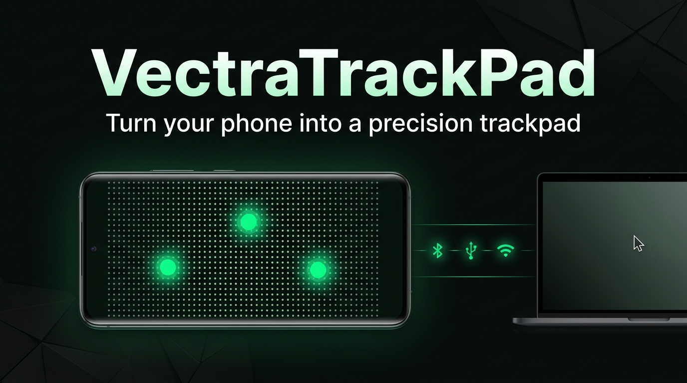
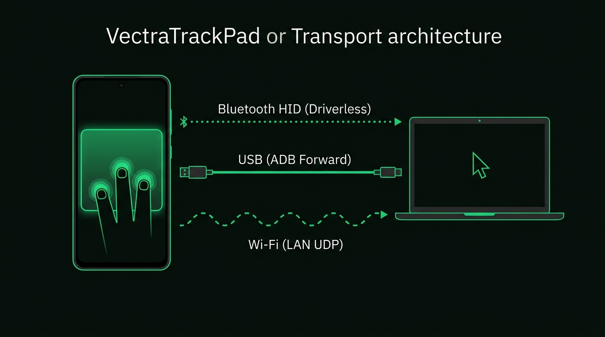
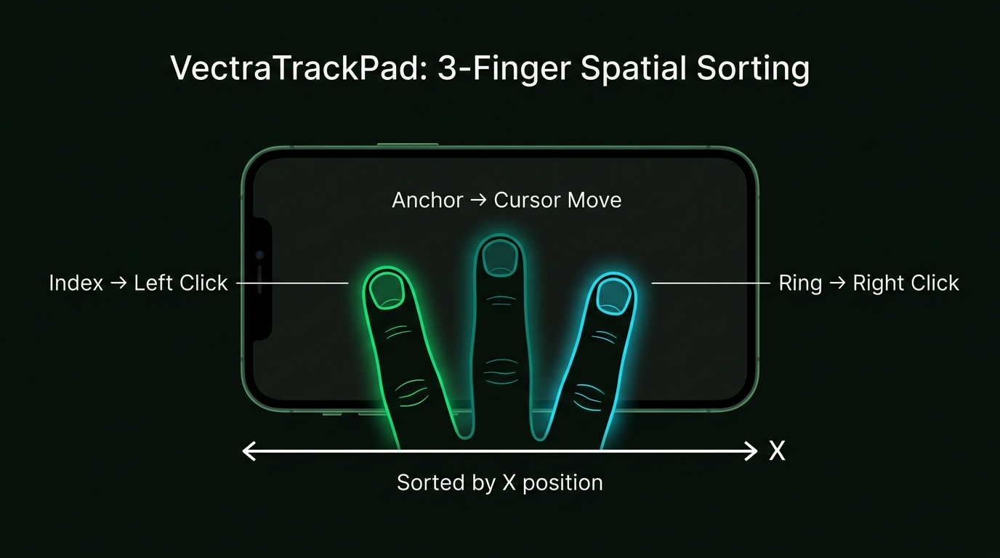
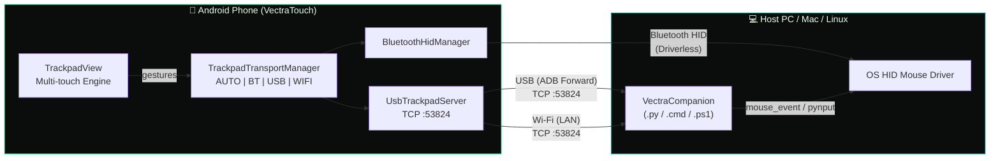
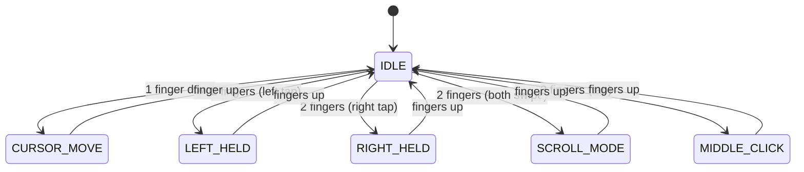

<!-- 
  VectraTouch — README
  SEO Keywords: Android trackpad app, phone as pc trackpad, phone as mouse, Bluetooth HID mouse,
  wireless trackpad for pc, USB ADB mouse, Wi-Fi remote mouse, driverless mouse,
  Android PC controller, spatial gesture trackpad, multi-touch mouse, virtual trackpad
-->

<div align="center">



# VectraTouch

### Phone as PC Trackpad & Mouse

**Driverless Bluetooth HID · Zero-Latency USB · Wi-Fi LAN · Spatial Multi-touch Gestures**

[](https://github.com/subhranilBCG/VectraTouch/releases/latest)
[](https://developer.android.com)
[](https://kotlinlang.org)
[](LICENSE)

---

[📥 Download APK](#-download--install) · [🚀 Quick Start](#-quick-start) · [🎯 Features](#-key-features) · [🏗️ Architecture](#%EF%B8%8F-transport-architecture) · [❓ FAQ](#-faq)

</div>

---

## 📖 What is VectraTouch?

**VectraTouch** is a high-performance Android utility that turns your smartphone into a **precision wireless and wired trackpad** for your PC, Mac, or Linux desktop. 

Unlike traditional remote mouse apps that require heavy server software, VectraTouch's **Bluetooth HID mode works completely driverless** — your phone pairs directly as a native Bluetooth mouse with zero PC-side installation. When you need ultra-low latency or are in crowded RF environments, switch instantly to **Zero-Latency USB (ADB)** or **Wi-Fi LAN** with UDP auto-discovery.

### Why VectraTouch?

| Problem | VectraTouch Solution |
|---|---|
| 🖱️ Forgot your mouse or touchpad broken? | Turn your phone into a precision trackpad in seconds |
| 📦 Don't want to install software on work PC? | **Bluetooth HID is 100% driverless** — native OS pairing |
| 🎮 Need zero lag for gaming or design? | **USB mode (ADB)** with sub-millisecond packet delivery |
| 🌐 Want wireless without Bluetooth pairing? | **Wi-Fi LAN mode** with instant UDP auto-discovery |
| 😤 Tired of cramped on-screen buttons? | **Full edge-to-edge trackpad** with smart spatial finger sorting |

---

## 📥 Download & Install

### Direct APK Download

<div align="center">

[](https://github.com/subhranilBCG/VectraTouch/releases/latest/download/VectraTouch-v1.0.0.apk)

</div>

> **System Requirements:** Android 9.0+ (API 28) · Bluetooth or USB debugging enabled

### Installation Steps

1. Download `VectraTouch-v1.0.0.apk` from the button above (or [GitHub Releases](https://github.com/subhranilBCG/VectraTouch/releases/latest)).
2. On your Android phone, enable **Install Unknown Apps** for your browser if prompted.
3. Tap **Install**.
4. Open **VectraTouch** and grant Bluetooth / Local Network permissions.

---

## 🎯 Key Features

### 🔀 Tri-Mode Transport — Connect Your Way



| Mode | How It Works | Best For |
|---|---|---|
| **🔵 Bluetooth HID** | Pairs as a native OS mouse — **no software needed on PC** | Everyday browsing, presentations, travel |
| **🔌 USB (ADB)** | Direct TCP over USB cable — zero packet latency | Gaming, CAD/editing, crowded Wi-Fi |
| **📶 Wi-Fi (LAN)** | TCP over local network + UDP auto-discovery beacon | Wireless freedom without Bluetooth pairing |
| **⚡ AUTO** | Intelligently selects the fastest active connection | Seamless automatic switching |

---

### 🖐️ Spatial Multi-touch Sorting — No Static Buttons



Instead of clumsy on-screen buttons that waste screen real estate, VectraTouch dynamically calculates finger roles based on horizontal (X-axis) coordinates across the whole display:

| Fingers | Gesture | Action |
|---|---|---|
| ☝️ **1 finger** | Drag anywhere | **Cursor movement** |
| ☝️☝️ **2 fingers** | Left finger tap / hold | **Left click / drag & drop** |
| ☝️☝️ **2 fingers** | Right finger tap / hold | **Right click** |
| ☝️☝️ **2 fingers** | Both fingers swipe up/down | **Natural smooth scroll** |
| ☝️☝️☝️ **3 fingers** | Simultaneous tap | **Middle click** |
| ☝️☝️ **2 fingers** | Quick tap (either side) | **Tap-to-click** |

---

### ⚙️ In-App Glassmorphic Settings

- **Cursor Sensitivity** — Fine-tune speed from `0.8×` to `2.8×` with instant presets and touch slider.
- **Orientation Modes** — Landscape, Reverse Landscape, Portrait, or Auto Sensor.
- **Persistent Preferences** — Remembers your sensitivity and preferred transport mode across launches.

---

### 🎨 Cyber Aesthetic UI

- **Matte Black** (`#0A0D0B`) background with **Cyber Green** (`#00E676`) glowing touch indicators.
- Non-intrusive watermark gesture HUD cards on canvas.
- Real-time connection badge with live IP/port indicators.
- Immersive edge-to-edge layout with full camera cutout / notch support.

---

## 🏗️ Transport Architecture



### Gesture State Machine



---

## 🚀 Quick Start

### Mode 1: Bluetooth HID (Driverless — Zero Setup on PC)

1. **Launch VectraTouch** on your phone.
2. Select the **`BT`** tab (or leave on `AUTO`).
3. On your **PC/Mac**, open **Bluetooth Settings → Add Device**.
4. Select your phone from the list — it pairs as a standard **Bluetooth mouse**.
5. **Done!** Move your finger on your phone screen to control the cursor.

---

### Mode 2: USB (ADB — Zero Latency)

1. Connect your phone to your PC via USB cable.
2. Enable **USB Debugging** on your phone (*Settings → Developer Options*).
3. On your PC, forward the port with ADB:
   ```bash
   adb forward tcp:53824 tcp:53824
   ```
4. Run the companion script:
   - **Windows:** Double-click `host/run_usb_windows.bat`
   - **Cross-Platform:** `python host/vectra_usb_host.py`
5. Select the **`USB`** tab in VectraTouch.

---

### Mode 3: Wi-Fi (LAN — Wireless without Bluetooth)

1. Connect phone and PC to the **same Wi-Fi network**.
2. Launch VectraTouch and select the **`WIFI`** tab (note the displayed phone IP).
3. Run the companion script on your PC:
   - **Windows (1-click):** Double-click `host/run_wifi_windows.bat`
   - **Python:** `python host/vectra_usb_host.py --wifi`
   - *(The companion auto-discovers your phone via UDP beacon on port `53826`)*
4. Cursor control begins immediately!

---

### 📦 Built-In Offline Companion Web Server

Don't have the companion script on your PC? VectraTouch runs an offline web server on your phone:

1. Open `http://<PHONE_IP>:8080` in your PC browser.
2. Download `VectraCompanion.cmd` or `VectraCompanion.py` directly from your phone.

| Companion Script | OS Support | Dependencies |
|---|---|---|
| `VectraCompanion.cmd` | Windows | None (native PowerShell wrapper) |
| `VectraCompanion.ps1` | Windows | Built-in PowerShell |
| `VectraCompanion.py` | Windows / Mac / Linux | Python 3 + `pynput` |

---

## 📁 Project Structure

```
VectraTrackPad/
├── app/
│   ├── src/main/
│   │   ├── java/com/example/vectratrackpad/
│   │   │   ├── MainActivity.kt              # Fullscreen, permissions, lifecycle
│   │   │   ├── TrackpadView.kt              # Canvas engine, gestures, HUD
│   │   │   ├── TrackpadTransportManager.kt  # Multi-transport coordinator
│   │   │   ├── BluetoothHidManager.kt       # BT HID profile & reports
│   │   │   ├── UsbTrackpadServer.kt         # TCP server + UDP beacon
│   │   │   └── CompanionHttpServer.kt       # HTTP server (port 8080)
│   │   ├── assets/
│   │   │   ├── index.html                   # Offline companion web page
│   │   │   ├── VectraCompanion.cmd          # Windows batch launcher
│   │   │   ├── VectraCompanion.ps1          # PowerShell companion
│   │   │   └── VectraCompanion.py           # Python companion
│   │   └── res/                             # Vector drawables, themes, strings
│   └── build.gradle.kts                     # App Gradle build config (v1.0.0)
├── host/
│   ├── vectra_usb_host.py                   # PC Python host script
│   ├── run_usb_windows.bat                  # 1-click Windows USB launcher
│   └── run_wifi_windows.bat                 # 1-click Windows Wi-Fi launcher
├── docs/images/                             # Architecture & gesture illustrations
└── README.md                                # Project documentation
```

---

## 🔧 Build from Source

```bash
# Clone the repository
git clone https://github.com/subhranilBCG/VectraTouch.git
cd VectraTouch

# Build debug APK with Gradle
./gradlew assembleDebug

# Output APK path:
# app/build/outputs/apk/debug/app-debug.apk
```

---

## 📋 HID Report Specification

| Byte | Field | Range | Description |
|---|---|---|---|
| 0 | Buttons | `0x01` / `0x02` / `0x04` | Left (`0x01`), Right (`0x02`), Middle (`0x04`) click bitmask |
| 1 | X Delta | `-127` to `127` | Relative horizontal cursor movement |
| 2 | Y Delta | `-127` to `127` | Relative vertical cursor movement |
| 3 | Scroll | `-127` to `127` | Scroll wheel delta |

---

## ❓ FAQ

<details>
<summary><strong>Does it really work without installing software on my PC?</strong></summary>

**Yes!** In **Bluetooth HID mode**, your Android device acts as a standard hardware Bluetooth mouse. Windows, macOS, Linux, ChromeOS, and iPadOS recognize it automatically without any additional drivers or client software.
</details>

<details>
<summary><strong>Which Android devices support Bluetooth HID?</strong></summary>

Any Android device on **Android 9.0 (API 28)** or newer with hardware `BluetoothHidDevice` profile support. Tested on Google Pixel, Samsung Galaxy, OnePlus, Xiaomi, and Motorola devices. If your phone manufacturer disabled HID, use USB or Wi-Fi mode.
</details>

<details>
<summary><strong>Can I use it on macOS or Linux?</strong></summary>

**Yes!** Bluetooth HID mode works out of the box. For USB and Wi-Fi modes, run `python host/vectra_usb_host.py` on Mac/Linux.
</details>

<details>
<summary><strong>How low is the latency?</strong></summary>

- **USB mode:** `< 1ms` sub-millisecond response over direct ADB socket.
- **Wi-Fi mode:** `1–5ms` on standard 5GHz / 2.4GHz Wi-Fi networks.
- **Bluetooth HID:** Standard BT HID polling (~`10–15ms`), identical to a wireless Bluetooth mouse.
</details>

<details>
<summary><strong>How do I change mouse sensitivity or rotate the screen?</strong></summary>

Tap the **⚙ (gear icon)** at the top of the trackpad. You can adjust the sensitivity slider or select from presets (`0.8×`, `1.4×`, `2.0×`, `2.8×`), and lock orientation to Landscape, Portrait, or Auto.
</details>

---

## 🤝 Contributing

Contributions, issues, and feature requests are welcome!  
Feel free to check the [issues page](https://github.com/subhranilBCG/VectraTouch/issues).

---

## 📄 License

This project is licensed under the MIT License — see the [LICENSE](LICENSE) file for details.

---

<div align="center">

**Made with 🖤 and ☝️ by [subhranilBCG](https://github.com/subhranilBCG)**

*VectraTouch — Phone as PC Trackpad & Mouse*

</div>
