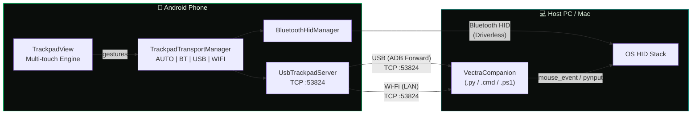
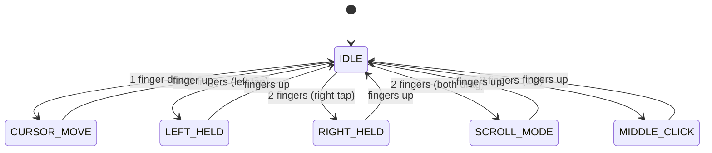

<!-- 
  VectraTrackPad — README
  SEO Keywords: Android trackpad app, phone as mouse, Bluetooth HID mouse,
  wireless trackpad, USB ADB mouse, Wi-Fi remote mouse, driverless mouse,
  Android PC controller, spatial gesture trackpad, multi-touch mouse
-->

<div align="center">


# VectraTrackPad

### Turn Your Android Phone into a Precision PC Trackpad

**Driverless Bluetooth HID · Zero-Latency USB · Wi-Fi LAN · Spatial Gesture Engine**

[](https://github.com/subhranilBCG/VectraTrackPad/releases/latest)
[](https://developer.android.com)
[](https://kotlinlang.org)
[](LICENSE)

---

[📥 Download APK](#-download--install) · [🚀 Quick Start](#-quick-start) · [🎯 Features](#-key-features) · [🏗️ Architecture](#%EF%B8%8F-transport-architecture) · [❓ FAQ](#-faq)

</div>

---

## 📖 What is VectraTrackPad?

**VectraTrackPad** is a high-performance Android app that transforms your smartphone into a **full-featured wireless trackpad** for your PC, Mac, or Linux machine. Unlike traditional remote mouse apps that require server software, VectraTrackPad's **Bluetooth HID mode works completely driverless** — your phone appears as a native Bluetooth mouse to any operating system.

### Why VectraTrackPad?

| Problem | VectraTrackPad Solution |
|---|---|
| 🖱️ Forgot your mouse? Touchpad broken? | Use your phone — it's always with you |
| 📦 Don't want to install PC software? | **Bluetooth HID is fully driverless** — zero host setup |
| 🎮 Need low-latency for gaming/design? | USB mode via ADB with **sub-millisecond** packet delivery |
| 🌐 Want wireless without Bluetooth? | Wi-Fi LAN mode with **UDP auto-discovery** |
| 😤 Hate tiny on-screen click buttons? | **Full edge-to-edge trackpad** with spatial finger sorting |

---

## 📥 Download & Install

### Direct APK Download

<div align="center">

[](https://github.com/subhranilBCG/VectraTrackPad/releases/latest/download/VectraTrackPad-v1.0.0.apk)

</div>

> **Requirements:** Android 9.0+ (API 28) · Bluetooth capable device

### Installation Steps

1. Download `VectraTrackPad-v1.0.0.apk` from the link above
2. On your Android phone, go to **Settings → Security → Install Unknown Apps** and allow your browser
3. Open the downloaded APK and tap **Install**
4. Launch **VectraTrackPad** and grant Bluetooth permissions when prompted

---

## 🎯 Key Features

### 🔀 Tri-Mode Transport — Connect Your Way


| Mode | How It Works | Best For |
|---|---|---|
| **🔵 Bluetooth HID** | Pairs as a native OS mouse — **no software needed on PC** | Everyday use, presentations, travel |
| **🔌 USB (ADB)** | Direct TCP over USB cable — zero-latency packets | Gaming, design work, reliability |
| **📶 Wi-Fi (LAN)** | TCP over local network + UDP auto-discovery beacon | Multi-device, no cable, no pairing |
| **⚡ AUTO** | Intelligently selects the best available transport | Set it and forget it |

### 🖐️ Spatial Gesture Sorting — No Buttons Needed


Instead of cramped on-screen buttons, VectraTrackPad uses an innovative **spatial sorting** algorithm. Place your fingers anywhere on the screen — their **X-axis positions** dynamically determine their roles:

| Fingers | Gesture | Action |
|---|---|---|
| ☝️ **1 finger** | Drag anywhere | **Move cursor** |
| ☝️☝️ **2 fingers** | Left finger tap/hold | **Left click / drag** |
| ☝️☝️ **2 fingers** | Right finger tap/hold | **Right click** |
| ☝️☝️ **2 fingers** | Both fingers swipe up/down | **Scroll** |
| ☝️☝️☝️ **3 fingers** | Simultaneous tap | **Middle click** |
| ☝️☝️ **2 fingers** | Quick tap (either side) | **Tap-to-click** |

### ⚙️ Glassmorphic Settings Panel

- **Mouse sensitivity** — Adjustable from `0.8×` to `2.8×` with steppers, slider, and presets
- **Screen orientation** — Landscape, Reverse Landscape, Portrait, Auto Sensor
- **Persistent preferences** — Settings saved automatically via SharedPreferences

### 🎨 Cyber Aesthetic UI

- **Matte black** (`#0A0D0B`) canvas with **cyber green** (`#00E676`) accents
- Matrix-style dot grid background
- Dim watermark gesture guide cards (non-intrusive HUD)
- Glowing touch point indicators with role labels
- Edge-to-edge immersive fullscreen with display cutout support

---

## 🏗️ Transport Architecture



### Gesture State Machine



---

## 🚀 Quick Start

### Mode 1: Bluetooth HID (Driverless — Zero Setup on PC)

1. **Launch** VectraTrackPad on your Android phone
2. **Select** the `BT` tab (or leave on `AUTO`)
3. On your **PC/Mac**, open **Bluetooth Settings** → **Add Device**
4. Select your phone from the list — it appears as a **Bluetooth mouse**
5. **Done!** Start moving your finger on the phone screen

### Mode 2: USB (ADB — Zero Latency)

1. **Connect** your phone to PC via USB cable
2. **Enable USB Debugging** on your phone (Settings → Developer Options)
3. On your PC, run the one-liner:
   ```bash
   adb forward tcp:53824 tcp:53824
   ```
4. **Launch** a companion script:
   - **Windows (1-click):** Double-click `host/run_usb_windows.bat`
   - **Python (cross-platform):** `python host/vectra_usb_host.py`
5. **Select** the `USB` tab in VectraTrackPad

### Mode 3: Wi-Fi (LAN — Wireless, No Pairing)

1. Ensure your **phone and PC are on the same Wi-Fi network**
2. **Launch** VectraTrackPad and select the `WIFI` tab — note the displayed **IP address**
3. On your PC, run the companion:
   - **Windows (1-click):** Double-click `host/run_wifi_windows.bat`
   - **Python:** `python host/vectra_usb_host.py --wifi`
   - The companion **auto-discovers** your phone via UDP beacon on port `53826`
4. **Done!** Cursor control begins immediately

### Companion Scripts (for USB & Wi-Fi modes)

The app bundles companion scripts for the PC host. You can also download them from your phone:

1. Open `http://<PHONE_IP>:8080` in your PC browser (served by the app's built-in HTTP server)
2. Download the companion script for your OS

| Script | Platform | Dependencies |
|---|---|---|
| `VectraCompanion.cmd` | Windows | None (wraps PowerShell) |
| `VectraCompanion.ps1` | Windows | PowerShell (built-in) |
| `VectraCompanion.py` | Windows / Mac / Linux | Python 3 |

---

## 📁 Project Structure

```
VectraTrackPad/
├── app/
│   ├── src/main/
│   │   ├── java/com/example/vectratrackpad/
│   │   │   ├── MainActivity.kt              # Permissions, fullscreen, lifecycle
│   │   │   ├── TrackpadView.kt              # Canvas engine, gestures, HUD
│   │   │   ├── TrackpadTransportManager.kt  # Multi-transport coordinator
│   │   │   ├── BluetoothHidManager.kt       # BT HID profile & reports
│   │   │   ├── UsbTrackpadServer.kt         # TCP server + UDP beacon
│   │   │   └── CompanionHttpServer.kt       # HTTP server (port 8080)
│   │   ├── assets/
│   │   │   ├── index.html                   # Offline companion download page
│   │   │   ├── VectraCompanion.cmd          # Windows batch launcher
│   │   │   ├── VectraCompanion.ps1          # PowerShell companion
│   │   │   └── VectraCompanion.py           # Python cross-platform companion
│   │   └── res/                             # Layouts, icons, themes, colors
│   └── build.gradle.kts                     # App-level Gradle config
├── host/
│   ├── vectra_usb_host.py                   # Host-side Python companion
│   ├── run_usb_windows.bat                  # 1-click USB launcher
│   └── run_wifi_windows.bat                 # 1-click Wi-Fi launcher
├── docs/images/                             # README illustrations
├── build.gradle.kts                         # Root Gradle config
├── settings.gradle.kts                      # Gradle settings
└── README.md                                # ← You are here
```

---

## 🔧 Build from Source

### Prerequisites

- **Android Studio** Hedgehog (2023.1.1) or later
- **JDK 11+**
- **Android SDK** with API 37 (compile) and API 28+ (min)

### Build Steps

```bash
# Clone the repository
git clone https://github.com/subhranilBCG/VectraTrackPad.git
cd VectraTrackPad

# Build debug APK
./gradlew assembleDebug

# Output: app/build/outputs/apk/debug/app-debug.apk
```

---

## 📋 HID Report Format

VectraTrackPad uses the standard USB HID Mouse report descriptor:

| Byte | Field | Range | Description |
|---|---|---|---|
| 0 | Buttons | `0x01` / `0x02` / `0x04` | Left / Right / Middle click bitmask |
| 1 | X Delta | `-127` to `127` | Relative horizontal movement |
| 2 | Y Delta | `-127` to `127` | Relative vertical movement |
| 3 | Scroll | `-127` to `127` | Scroll wheel delta |

---

## ❓ FAQ

<details>
<summary><strong>Does it work without installing anything on my PC?</strong></summary>

**Yes!** In **Bluetooth HID mode**, your phone registers as a native Bluetooth mouse. No drivers, no companion software, no setup — just pair and go. USB and Wi-Fi modes require a lightweight companion script (included).
</details>

<details>
<summary><strong>Which Android devices are supported?</strong></summary>

Any Android device running **Android 9.0 (API 28)** or higher with **Bluetooth HID Device** profile support. Most modern Samsung, Pixel, OnePlus, and Xiaomi devices are supported. Some budget devices may not expose the HID Device profile.
</details>

<details>
<summary><strong>Can I use it with a Mac?</strong></summary>

**Yes!** Bluetooth HID mode works natively with macOS. For USB/Wi-Fi mode, use the Python companion: `python VectraCompanion.py`.
</details>

<details>
<summary><strong>Is there input lag?</strong></summary>

- **USB mode:** Sub-millisecond latency (direct TCP over ADB)
- **Wi-Fi mode:** 1–5ms on a good LAN connection
- **Bluetooth HID:** Typical BT HID latency (~10–30ms), comparable to a physical Bluetooth mouse
</details>

<details>
<summary><strong>My phone doesn't show up as a Bluetooth mouse</strong></summary>

1. Ensure **Bluetooth is ON** and permissions are granted
2. Some devices don't support the `BluetoothHidDevice` profile — try USB or Wi-Fi mode instead
3. Only one app can register as a HID device at a time. Close any other Bluetooth keyboard/mouse apps
4. Try toggling Bluetooth off and on, then re-pair
</details>

<details>
<summary><strong>How do I adjust mouse sensitivity?</strong></summary>

Tap the **⚙ (gear icon)** at the top of the trackpad screen. Use the sensitivity slider or preset buttons (`0.8×`, `1.4×`, `2.0×`, `2.8×`). Settings are saved automatically.
</details>

---

## 🛣️ Roadmap

- [ ] Keyboard input mode (type from phone)
- [ ] Custom gesture macros (map multi-finger gestures to shortcuts)
- [ ] Media control integration (play/pause, volume)
- [ ] Presentation mode (slideshow control with gestures)
- [ ] Dark/light theme toggle

---

## 🤝 Contributing

Contributions are welcome! Feel free to:

1. **Fork** the repository
2. **Create** a feature branch (`git checkout -b feature/amazing-feature`)
3. **Commit** your changes (`git commit -m 'Add amazing feature'`)
4. **Push** to the branch (`git push origin feature/amazing-feature`)
5. **Open** a Pull Request

---

## 📄 License

This project is licensed under the MIT License — see the [LICENSE](LICENSE) file for details.

---

## 🌟 Star This Project

If VectraTrackPad helped you, consider giving it a ⭐ on GitHub — it helps others discover it!

<div align="center">

**Made with 🖤 and ☝️ by [subhranilBCG](https://github.com/subhranilBCG)**

*VectraTrackPad — Because your phone is the best trackpad you already own.*

</div>
